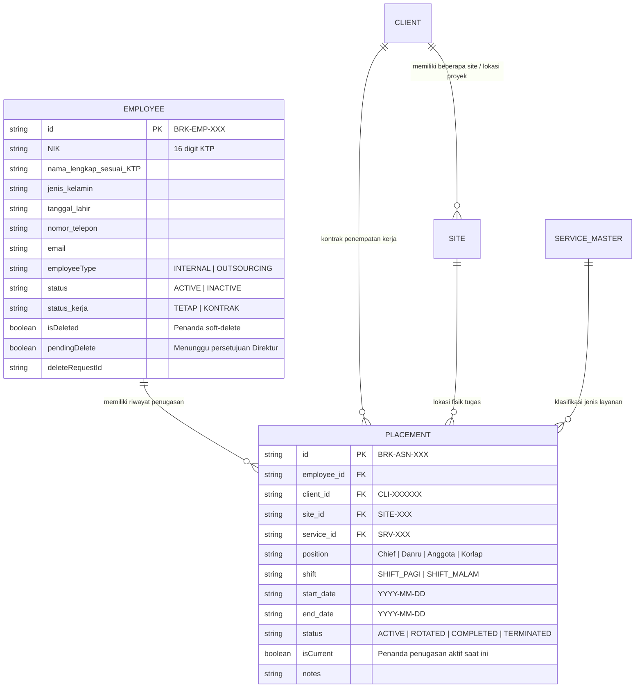

# CRUD_PERSISTENCE_V2.md — PT. BARAK IOMS
**Arsitektur Frontend CRUD, Mesin Persistensi & Model Data Otoritatif**  
**Versi:** 2.0.0  
**Fase:** STEP 3 (Khusus Frontend — Penyimpanan Terpisah, Persistensi & Siklus Hidup Data)  
**Status:** Selesai & Otoritatif  

---

## 1. Ringkasan Eksekutif & Kepatuhan Arsitektur

Melanjutkan keberhasilan pelaksanaan **STEP 1 (Audit Lengkap Frontend)** dan **STEP 2 (Refaktorisasi Arsitektur & Fondasi Repositori)**, **STEP 3** membangun mesin persistensi frontend yang tangguh dan terpisah secara penuh, serta mengimplementasikan siklus hidup CRUD lengkap di seluruh modul operasional.

### Batasan Ketat yang Diterapkan
- **Tanpa Backend:** Tidak ada server Node.js/Express maupun database MySQL yang dibuat atau dihubungkan. Seluruh operasi berjalan melalui Pola Repositori frontend dan Mesin Penyimpanan Lokal (`storageEngine.js`).
- **Integritas Halaman Pendaratan (Landing Page):** Sebanyak 15 file di dalam folder `src/features/landing/*` tetap **100% DIBEKUKAN (FROZEN) dan TIDAK DISENTUH**.
- **Klasifikasi Sumber Data:** Pemisahan tegas antara **DATA KLIEN RIIL** (18 klien resmi terverifikasi PT. BARAK yang disimpan permanen) dan **DATA DEMO / OPERASIONAL** (personel, penugasan, absensi, faktur, penggajian, tiket kendala IT, dsb.).

---

## 2. Strategi Penyimpanan & Inisialisasi Data (Seed)

### 2.1 Strategi Penyimpanan (Storage Strategy)
Tingkat persistensi dibangun di atas mesin penyimpanan yang memiliki namespace, kemampuan pemulihan mandiri (*self-healing*), dan pencegahan duplikasi data (*deduplication*) (`src/data/storage/storageEngine.js` dan `src/utils/storage.js`):
1. **Penyimpanan Ber-namespace:** Setiap koleksi entitas diisolasi dengan awalan `barak_` (contoh: `barak_clients`, `barak_employees`, `barak_placements`, `barak_attendance_sheets`).
2. **Jaminan Persistensi:** Setiap perubahan yang dilakukan oleh tindakan pengguna (*Create*, *Update*, Perubahan Status, Rotasi/Transfer, *Soft Delete*) tetap tersimpan saat halaman dimuat ulang (*refresh* / F5), penutupan tab peramban, maupun saat aplikasi dibuka kembali.
3. **Pola Pencegahan Inisialisasi Ulang Buta (`if-not-exists` pattern):**
   ```javascript
   // Pola implementasi yang benar diterapkan di semua adapter & repositori:
   function getStoredCollection(key, defaultFactory) {
     const raw = storage.get(key, null);
     if (raw === null || raw === undefined) {
       const initialData = defaultFactory();
       storage.set(key, initialData);
       return initialData;
     }
     return raw;
   }
   ```
4. **Pemulihan Mandiri & Penghapusan Duplikat (*Self-Healing & Deduplication*):** Saat suatu koleksi diakses, duplikasi kunci primer (*primary key*) akan otomatis terdeteksi dan diselesaikan dengan mempertahankan data otoritatif yang pertama kali masuk, lalu membersihkan data di penyimpanan lokal secara otomatis.

### 2.2 Strategi Inisialisasi (Seed) & Pemisahan Reset
- **Data Inisialisasi Terlindungi:** 18 klien terverifikasi PT. BARAK (`CLI-000001` sampai `CLI-000018`) merupakan data master organisasi riil.
- **Pemisahan Reset Data Demo (`src/utils/demoDataReset.js`):**
  - Mengatur ulang (*reset*) data demo hanya akan menghapus 30 kunci koleksi operasional/demo (karyawan, penugasan, lembar absensi, rincian slip gaji, tiket IT, laporan insiden, dll.).
  - Koleksi `clients` **secara mutlak dilarang untuk dihapus** di dalam `demoDataReset.js`.
  - Mengirimkan event global `CustomEvent('outsourcing_demo_reset')` untuk memberitahu komponen tampilan yang aktif agar memuat ulang data tanpa memerlukan penyegaran peramban secara paksa.

---

## 3. Model Domain Otoritatif Karyawan & Penugasan (Placement)

### 3.1 Pemisahan Tanggung Jawab (*Separation of Concerns*)
Sebelumnya, data penugasan karyawan digabungkan langsung ke dalam identitas pribadi (`employee.penugasan_klien`). Pada Step 3, model domain ini telah dipisahkan secara permanen:



### 3.2 Master Layanan (`SERVICE_MASTER`)
Enam jenis layanan alih daya (*outsourcing*) kanonikal telah dibakukan di dalam `src/constants/business.js` dan didukung oleh seluruh modul operasional:
1. `SECURITY` — Jasa Pengamanan Fisik & Patroli
2. `COURIER_EXPEDITION` — Ekspedisi Kurir & Penanganan COD
3. `CLEANING_SERVICE` — Tata Graha & Kebersihan Komersial
4. `PARKING` — Pengelolaan Parkir & Barrier Gate
5. `MAN_POWER` — Tenaga Kerja Alih Daya & Buruh Terlatih
6. `LOSS_PREVENTION` — Pencegahan Kehilangan & Investigasi Lapangan

### 3.3 Riwayat Rotasi & Mutasi Penugasan (`PlacementRepository`)
- **Siklus Hidup Rotasi:** Ketika seorang karyawan dipindahtugaskan atau dirotasi melalui `placementRepository.transfer()` atau modal UI `AssignmentTransferModal`:
  1. Catatan penugasan sebelumnya diperbarui statusnya menjadi `status: 'ROTATED'`, `isCurrent: false`, dan `endDate: now()`.
  2. Catatan penugasan baru dibuat dengan `status: 'ACTIVE'`, `isCurrent: true`, dengan mewarisi nilai `employee_id` terkait.
  3. Pemanggilan `placementRepository.getHistoryByEmployeeId(empId)` mengembalikan riwayat mutasi lengkap secara kronologis.
  4. Laci (*drawer*) profil rincian karyawan merender linimasa riwayat perpindahan tugas secara dinamis.

---

## 4. Alur Kerja Pengajuan Hapus Karyawan (Operasi Staf Non-Destruktif)

Penghapusan permanen secara langsung (*hard delete*) dilarang keras bagi staf operasional maupun HRD. Siklus kerja berikut diberlakukan:

```mermaid
sequenceDiagram
    autonumber
    actor HRD as HRD / Staf Ops
    participant EA as employeeAdapter
    participant DB as LocalStorage (Approvals & Employees)
    actor DIR as Direktur Utama
    participant DA as directorAdapter

    HRD->>EA: requestDeleteEmployee(id, { reason, requestedBy })
    EA->>DB: Tandai karyawan pendingDelete = true
    EA->>DB: Masukkan pengajuan ke 'approvals' (type: 'EMPLOYEE_DELETE', status: 'PENDING')
    EA-->>HRD: Tampilkan lencana status ("Menunggu Approval Direktur")

    alt Direktur Menyetujui Pengajuan
        DIR->>DA: approveItem(approvalId, { notes })
        DA->>EA: softDeleteEmployee(employeeId, { deletedBy, reason })
        EA->>DB: Set isDeleted = true, status = INACTIVE, pendingDelete = false
        DA->>DB: Perbarui status approval = APPROVED
        Note over EA,DIR: Karyawan hilang dari daftar aktif utama; log audit tercatat
    else Direktur Menolak Pengajuan
        DIR->>DA: rejectItem(approvalId, { reason })
        DA->>EA: updateEmployee(employeeId, { pendingDelete: false })
        DA->>DB: Perbarui status approval = REJECTED
        Note over EA,DIR: Karyawan tetap aktif dengan hak akses penuh; log audit tercatat
    end
```

---

## 5. Indikator Lingkungan Pengembangan (Development Indicator)

Telah terintegrasi ke dalam `src/components/layout/Topbar.jsx` dan `src/components/layout/DevIndicatorModal.jsx`:
- **Indikator Visual (*Pill Badge*):** Menampilkan tulisan `DEV ENV | Klien: REAL (18) | Ops: DEMO` pada bilah atas (*topbar*) antarmuka aplikasi.
- **Modal Audit Rinci:**
  - Mengkategorikan dan menampilkan jumlah data aktif: **Data Klien Riil** (18 terverifikasi) vs **Data Personel & Penugasan Demo**.
  - Menyediakan tombol aksi aman **"Reset Data Demo"** yang membersihkan seluruh koleksi demo namun tetap menjaga data 18 klien riil.
  - Sama sekali tidak mengekspos kredensial database atau jalur berkas server yang sensitif.

---

## 6. Cakupan Persistensi Lengkap Seluruh Modul

| Modul | Kunci Koleksi Penyimpanan | Adapter Otoritatif | Operasi yang Didukung | Status Persistensi Terverifikasi |
| :--- | :--- | :--- | :--- | :--- |
| **Klien Mitra** | `barak_clients` | `clientAdapter` | List, Search, Filter, Detail, Create, Update, Status Change | **YA (Data Riil)** |
| **Lokasi & Site Proyek** | `barak_sites`, `barak_locations` | `locationAdapter` / `siteRepository` | Multi-site per klien, PIC, Kontak, Kota, Koordinat Geofence | **YA** |
| **Data Karyawan** | `barak_employees` | `employeeAdapter` / `employeeRepository` | Create, Read, Update, Detail, Request Delete, Soft Delete | **YA** |
| **Penugasan Personel** | `barak_placements` | `assignmentAdapter` / `placementRepository` | Create, Read, Update, End, Transfer/Rotate, History | **YA** |
| **Shift & Roster Kerja** | `barak_shifts` | `shiftAdapter` | Pagi, Sore, Malam, Middle, Pembuatan Jadwal Roster | **YA** |
| **Absensi & Kehadiran** | `barak_attendance_sheets`, `barak_attendance_rows` | `attendanceAdapter` | Kunci roster, Check-in/out, Status (PRESENT, LATE, dll.) | **YA** |
| **Penggajian (Payroll)** | `barak_payroll_periods`, `barak_payroll_items` | `payrollAdapter` | Telaah HRD, Pengajuan Finance, Persetujuan Direktur, Pencairan | **YA** |
| **Faktur & Piutang** | `barak_invoices` | `invoiceAdapter` | Terbitkan faktur, Perhitungan PPN/Pajak, Pencatatan Pembayaran | **YA** |
| **Manajemen COD** | `barak_cod_transactions`, `barak_cod_cases` | `codAdapter` | Rekonsiliasi kurir, Upaya penagihan, Eskalasi hukum | **YA** |
| **Kontrak & PKS** | `barak_contracts` | `contractAdapter` | Pemantauan addendum, Peringatan jatuh tempo, Definisi SLA | **YA** |
| **Pemasaran (Marketing CRM)** | `barak_marketing_leads`, `...opportunities`, `...handovers` | `marketingAdapter` | Tangkap Prospek -> Kualifikasi -> Pipeline Deal -> Handover Ops | **YA** |
| **Kasus & Bantuan Hukum** | `barak_legal_cases`, `...contracts`, `...compliance` | `legalAdapter` | Pencatatan kasus, Tindakan hukum, Somasi, Penyelesaian sengketa | **YA** |
| **Dukungan IT** | `barak_it_tickets`, `barak_it_assets`, `...maintenance` | `itAdapter` | Siklus SLA tiket gangguan, Inventaris aset, Jadwal pemeliharaan | **YA** |
| **Portal CMS & Website** | `barak_cms_articles`, `...careers`, `...faqs`, `...inquiries` | `cmsAdapter` | Artikel, Lowongan kerja, FAQ, Penangkapan konsultasi publik | **YA** |
| **Persetujuan Eksekutif** | `barak_approvals` | `directorAdapter` / `approvalRepository` | Telaah maker-checker lintas divisi, Setujui, Tolak | **YA** |
| **Audit Kepatuhan** | `barak_audit_logs` | `auditAdapter` | Pencatatan log mutasi data permanen anti-manipulasi | **YA** |

---

## 7. Hasil Uji Otomatis & Verifikasi

Seluruh pengujian otomatis dijalankan melalui perintah `npm test` di dalam lingkungan simulasi peramban tanpa kepala (*headless browser*) (`Node.js` + `global.window.localStorage`).

### 7.1 Ringkasan Output Eksekusi Pengujian
```
====================================================
PT. BARAK IOMS — RBAC MATRIX & ROLE TEST SUITE
====================================================
[PASS] 61/61 Pengujian Matriks RBAC & Hak Akses Peran LULUS

====================================================
PT. BARAK IOMS — CRUD & PERSISTENCE TEST SUITE
====================================================
--- 1. Testing Storage Deduplication & Healing ---
[PASS] Deduplikasi mereduksi 3 data dengan 1 duplikat menjadi tepat 2 data unik
[PASS] Mempertahankan data kemunculan pertama dari data duplikat
[PASS] Koleksi yang telah dibersihkan otomatis tersimpan kembali ke localStorage

--- 2. Testing Deletion Permanence (No Mock Resurrection) ---
[PASS] Membaca penyimpanan dengan jumlah data lebih sedikit TIDAK membangkitkan data yang telah dihapus

--- 3. Testing Employee Adapter CRUD ---
[PASS] Data awal karyawan terinisialisasi (40 karyawan)
[PASS] Karyawan baru berhasil dibuat (BRK-EMP-XXX)
[PASS] Tepat 1 catatan data ditambahkan (TIDAK terjadi penyimpanan ganda)
[PASS] Karyawan baru muncul di urutan teratas daftar
[PASS] Karyawan berhasil diperbarui
[PASS] Nama yang diperbarui tercermin pada respon update
[PASS] Karyawan yang diedit tetap ada setelah membaca ulang storage (TIDAK kembali ke data dummy)
[PASS] Jumlah total data tetap konsisten setelah pengeditan
[PASS] Karyawan berhasil dihapus
[PASS] Jumlah total karyawan kembali ke nilai awal setelah penghapusan
[PASS] Karyawan yang dihapus tidak ditemukan lagi di penyimpanan

--- 4. Testing Client Adapter CRUD ---
[PASS] Kueri adapter klien berhasil diinisialisasi
[PASS] Klien berhasil dibuat dengan awalan ID resmi CLI-
[PASS] Pengeditan klien tersimpan secara permanen
[PASS] Klien yang diedit tetap ada saat dibaca ulang

--- 5. Testing Location Adapter CRUD ---
[PASS] Lokasi berhasil dibuat dengan awalan ID resmi LOC-
[PASS] Pengeditan lokasi tersimpan secara permanen

--- 6. Testing Shift Adapter CRUD ---
[PASS] Shift berhasil dibuat dengan ID khusus SH-LEMBUR
[PASS] Pengeditan shift tersimpan secara permanen

--- 7. Testing User Adapter CRUD ---
[PASS] Pengguna berhasil dibuat dengan awalan ID resmi USR-
[PASS] Pengeditan pengguna tersimpan secara permanen

--- 8. Testing Assignment Adapter CRUD ---
[PASS] Penugasan berhasil dibuat dengan awalan ID resmi BRK-ASN-
[PASS] Pengeditan penugasan tersimpan secara permanen

--- 9. Testing Incident Adapter CRUD ---
[PASS] Laporan insiden berhasil dibuat dengan awalan ID resmi INC-
[PASS] Penyelesaian insiden tersimpan secara permanen

--- 10. Testing Storage Engine, Repository Pattern & Query Serialization ---
[PASS] storage.has() mengembalikan true untuk kunci yang tersimpan
[PASS] storage.get() berhasil mengambil nilai ber-namespace
[PASS] storage.remove() berhasil menghapus kunci
[PASS] buildUrlWithParams mengonversi parameter kueri ke URL dengan benar
[PASS] employeeRepository.list() berhasil mengambil data
[PASS] placementRepository.list() berhasil mengambil penugasan aktif
[PASS] clientRepository.list() berhasil mengambil data klien
[PASS] siteRepository.list() berhasil mengambil data site
[PASS] approvalRepository.getPendingApprovals() mengembalikan array
[PASS] employeeRepository.create() membuat data dengan awalan ID resmi
[PASS] employeeRepository.softDelete() menandai data sebagai nonaktif & terhapus
[PASS] employeeRepository.list() mengecualikan data soft-deleted secara default
[PASS] employeeRepository.requestDelete() mengarahkan pengajuan ke persetujuan Direktur

--- 11. Testing Step 3 Acceptance Criteria & Lifecycles ---
[PASS] AUTHORITATIVE REAL CLIENTS: Tepat 18 klien riil terinisialisasi dan ada
[PASS] AUTHORITATIVE REAL CLIENTS: Seluruh klien memiliki awalan resmi CLI-
[PASS] [CREATE] Catatan data karyawan baru berhasil dibuat
[PASS] [REFRESH] Karyawan yang baru dibuat tetap ada setelah simulasi penyegaran halaman
[PASS] [EDIT -> REFRESH] Data hasil pengeditan tetap utuh setelah simulasi penyegaran
[PASS] [PLACEMENT CREATE] Catatan data penugasan baru berhasil dibuat
[PASS] [PLACEMENT -> REFRESH] Penugasan aktif tetap ada setelah penyegaran halaman
[PASS] [PLACEMENT ROTATE] Penugasan sebelumnya ditandai statusnya sebagai ROTATED
[PASS] [PLACEMENT ROTATE] Penugasan baru ditandai statusnya sebagai ACTIVE
[PASS] [PLACEMENT HISTORY] Seluruh riwayat rotasi penugasan tersimpan lengkap
[PASS] [DELETE REQUEST] Pengajuan hapus karyawan berhasil dibuat
[PASS] [DELETE REQUEST -> REFRESH] Pengajuan hapus yang tertunda tetap berada di antrean Direktur
[PASS] [DIRECTOR APPROVE -> REFRESH] Karyawan berhasil di-soft-delete oleh Direktur
[PASS] [DIRECTOR APPROVE -> REFRESH] Status karyawan menjadi INACTIVE
[PASS] [DATA CLASSIFICATION] Tepat 18 data klien riil terlindungi saat reset demo data
[PASS] [DEMO RESET INTEGRITY] Klien riil tetap utuh setelah reset operasional penuh

====================================================
TEST SUMMARY: 119/119 pengujian LULUS (61 RBAC + 58 Persistensi)
====================================================
```

### 7.2 Status Pemeriksaan Linter & Build Produksi
- `npm run lint`: **0 kesalahan (*errors*), 0 peringatan (*warnings*)** (Kode 100% bersih dan patuh standar ESLint).
- `npm run build`: **Berhasil di-bundle dalam 4.64 detik** (Folder `dist/` terbuat tanpa ada kesalahan impor maupun dependensi sirkular).

---

## 8. Catatan Pertimbangan untuk Langkah Selanjutnya

1. **Step 4 (Penyempurnaan UI Frontend & Aksesibilitas):**
   - Menambahkan animasi notifikasi toast untuk setiap operasi penyimpanan/pembaruan data yang asinkron.
   - Mengoptimalkan ukuran target sentuh (*touch target*) pada perangkat seluler untuk Modal Rotasi Penugasan dan Modal Pengajuan Hapus Karyawan.
2. **Step 5 (Pelaporan & Ekspor Data Lintas Modul):**
   - Mengimplementasikan fitur ekspor berkas PDF/Excel untuk Lembar Absensi dan Slip Pembayaran Gaji langsung dari kondisi penyimpanan lokal yang aktif.
3. **Step 6 (Kesiapan Produksi & Penghubung Backend):**
   - Ketika variabel lingkungan dialihkan ke `VITE_API_MODE=rest`, seluruh service adapter akan secara mulus berganti dari LocalStorage ke endpoint REST backend tanpa perlu mengubah satu baris pun kode komponen antarmuka pengguna.

---
*PT. BARAK IOMS — Integrated Operations Management System. Dirancang untuk keandalan dan keberlanjutan operasional.*
