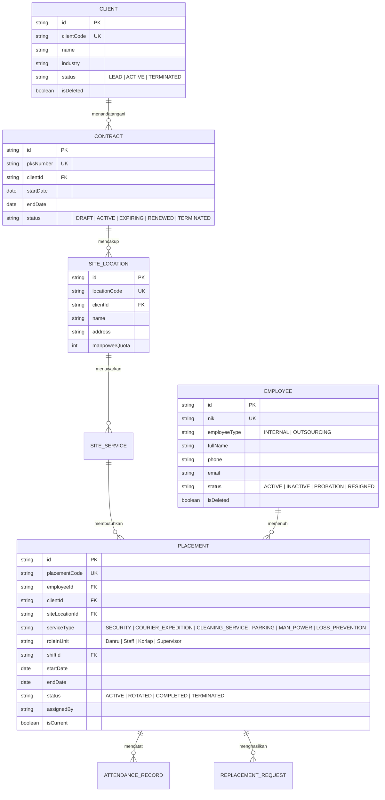
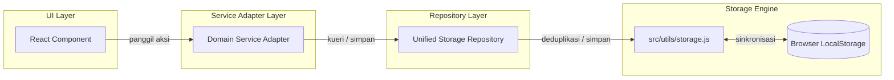
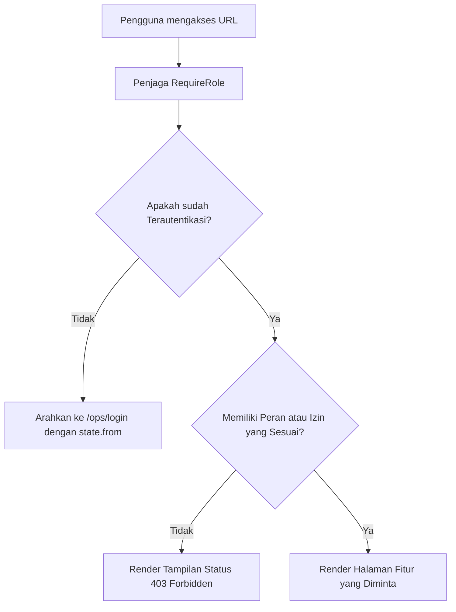
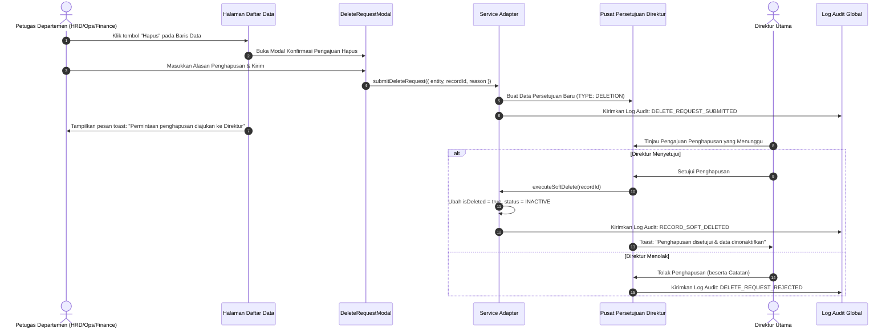
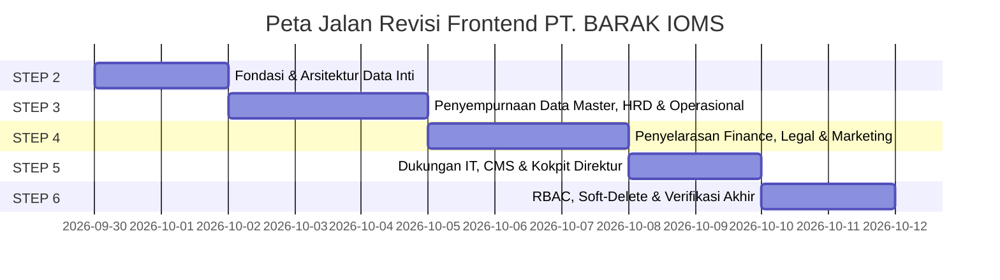

# RENCANA ARSITEKTUR FRONTEND — PT. BARAK IOMS
**Repositori Target:** `bimasenaadhirajasaradika_fe`  
**Aplikasi:** PT. Bhimasena Adhirajasa Radhika — Integrated Outsourcing Management System (IOMS)  
**Versi Dokumen:** 1.0 (Arsitektur Dasar untuk Tahapan Step 2–6)  
**Tanggal Pembuatan:** 2026-09-29  

---

## S. ARSITEKTUR TARGET YANG DIREKOMENDASIKAN

### 1. Model Domain Utama & Pemisahan Keterikatan (Decoupling)

Domain bisnis aplikasi mencerminkan tata kelola perusahaan alih daya tenaga kerja terpadu di Indonesia dengan 3 domain data utama, 6 lini layanan outsourcing kanonikal, serta rantai relasi data yang terpisah secara tegas.



#### A. Tiga Domain Data Utama
1. **Karyawan Internal (Personel Kantor Pusat):**
   - Tenaga kerja yang bekerja langsung untuk operasional korporat PT. BARAK (Direksi, HRD, Finance, Legal, Marketing, IT Support).
   - Atribut: NIK, Divisi, Jabatan Internal, Grade, Rekening Gaji, Tanggal Bergabung.
   - **TIDAK memiliki kolom penugasan klien atau site proyek.**
2. **Karyawan Outsourcing (Personel Penempatan Lapangan):**
   - Tenaga kerja alih daya yang ditempatkan di lokasi klien pada 6 jenis layanan kerja.
   - Atribut: NIK, Lisensi Gada Pratama/Madya, SIM B1, Sertifikasi K3, Tinggi/Berat badan, Riwayat Penempatan, Status Kesiapan (*Ready Pool* / *Active Assignment*).
3. **Klien & Kontrak Kerjasama:**
   - Mitra korporat eksternal (contoh: J&T Logistik, Surya Dunia Express, Megah Jaya Semesta).
   - Hirarki: `Client` -> `Contract / PKS` -> `Site / Lokasi Proyek` -> `Service Line`.

#### B. Enam Lini Layanan Outsourcing Kanonikal
Ditegakkan sebagai enum domain huruf kapital baku di `src/constants/business.js`:
- `SERVICE_TYPES.SECURITY`: Jasa Pengamanan & Penjagaan Perimeter (Satpam/Danru/Korlap).
- `SERVICE_TYPES.COURIER_EXPEDITION`: Ekspedisi Kurir & Pengiriman Logistik Drop Point / COD.
- `SERVICE_TYPES.CLEANING_SERVICE`: Kebersihan Komersial, Sanitasi, & Housekeeping Gedung.
- `SERVICE_TYPES.PARKING`: Manajemen Parkir, Valet, & Pengendalian Barrier Gate Kendaraan.
- `SERVICE_TYPES.MAN_POWER`: Tenaga Kerja Umum, Resepsionis, Operator Forklift, Administrasi Lapangan.
- `SERVICE_TYPES.LOSS_PREVENTION`: Pengawalan Khusus, Audit Investigasi Aset, & Proteksi Pencegahan Kerugian.

#### C. Pemisahan Tegas: Karyawan vs. Penugasan (Placement)
- **Dihapus dari Master Karyawan:** Kolom hardcoded `penugasan_klien`, `clientName`, `lokasi_penugasan`, `locationName`, `jenis_layanan`, dan kolom tunggal `jabatan`.
- **Memperkenalkan Model Penugasan Otoritatif (`Placement`):**
  - Merepresentasikan penempatan tugas karyawan pada suatu `Client`, `Site`, `Service Line`, `Shift`, dan `Role In Unit` tertentu.
  - Mendukung pencatatan **Riwayat Penugasan Lengkap** (Aktif, Dirotasi, Selesai, Dipindahtugaskan).
  - Memungkinkan karyawan berada dalam status cadangan (*Standby / Unassigned Pool*) tanpa menyebabkan kerusakan relasi foreign key.

---

## 2. Repositori Terpadu & Mesin Persistensi

Untuk mengatasi bug kehilangan data di mana 13 modul ter-reset saat halaman di-refresh (F5), seluruh adapter akan didukung oleh **Pola Repositori Terstandarisasi** di atas `src/utils/storage.js`.



#### Fitur Mesin Penyimpanan:
1. **Kunci Penyimpanan Menyeluruh:**
   - Master Data: `barak_employees`, `barak_clients`, `barak_locations`, `barak_projects`, `barak_shifts`, `barak_users`.
   - Penugasan: `barak_placements`, `barak_placement_history`.
   - Operasional: `barak_incidents`, `barak_replacements`, `barak_field_reports`, `barak_patrol_schedules`.
   - HRD: `barak_attendance_sheets`, `barak_attendance_rows`, `barak_payroll_summaries`, `barak_hr_contracts`.
   - Finance: `barak_invoices`, `barak_receivables`, `barak_payments`, `barak_payroll_periods`, `barak_payroll_items`, `barak_expenses`, `barak_cod_transactions`, `barak_cod_cases`.
   - Legal: `barak_legal_cases`, `barak_legal_contracts`, `barak_compliance`, `barak_somasi`, `barak_licenses`.
   - Pemasaran: `barak_leads`, `barak_opportunities`, `barak_surveys`, `barak_quotations`, `barak_proposals`, `barak_handovers`.
   - Dukungan IT: `barak_it_tickets`, `barak_it_assets`, `barak_maintenance_schedules`, `barak_backup_logs`.
   - CMS Website: `barak_cms_articles`, `barak_cms_careers`, `barak_cms_applicants`, `barak_cms_faqs`, `barak_cms_inquiries`, `barak_cms_seo`.
   - Direktur & Tata Kelola: `barak_delete_requests`, `barak_director_approvals`, `barak_audit_logs`.
2. **Pemulihan Mandiri & Deduplikasi:** Otomatis menghapus duplikasi data berdasarkan kunci primer unik saat data dimuat.
3. **Sinkronisasi Lintas Tab:** Mengirimkan custom event (`barak_storage_updated`) untuk memberitahukan tab peramban yang aktif mengenai perubahan data.
4. **Utilitas Reset & Seed yang Bersih:** Menyediakan fungsi pengembangan untuk mengatur ulang data ke data dasar tiruan yang bersih atau mengekspor kondisi saat ini.

---

## 3. Arsitektur Klien REST API yang Diperbaiki

File `src/services/apiClient.js` ditingkatkan untuk memastikan transisi yang mulus antara mode tiruan (mock) dan backend REST produksi tanpa merusak adapter.

```javascript
// Target Arsitektur apiClient.js
const restClient = {
  buildUrl(path, params) {
    const url = new URL(`${API_BASE_URL}${path}`);
    if (params) {
      Object.entries(params).forEach(([key, value]) => {
        if (value !== undefined && value !== null && value !== '') {
          url.searchParams.append(key, String(value));
        }
      });
    }
    return url.toString();
  },

  async request(path, options = {}) {
    const { params, headers: customHeaders, body, ...fetchOpts } = options;
    const fullUrl = restClient.buildUrl(path, params);
    const token = sessionStorage.getItem('barak_token');
    
    const headers = {
      'Content-Type': 'application/json',
      ...(token ? { Authorization: `Bearer ${token}` } : {}),
      ...customHeaders,
    };

    try {
      const response = await fetch(fullUrl, {
        ...fetchOpts,
        headers,
        body: body ? JSON.stringify(body) : undefined,
      });

      const json = await response.json();
      if (!response.ok) {
        return apiError(
          json?.error?.code || `HTTP_${response.status}`,
          json?.error?.message || `Request failed with status ${response.status}`,
          json?.error?.fields || {}
        );
      }
      return json; // Format amplop standar: { data, meta, error: null }
    } catch (err) {
      return apiError('NETWORK_ERROR', err.message || 'Koneksi jaringan gagal.');
    }
  },

  get: (path, options = {}) => restClient.request(path, { method: 'GET', ...options }),
  post: (path, body, options = {}) => restClient.request(path, { method: 'POST', body, ...options }),
  put: (path, body, options = {}) => restClient.request(path, { method: 'PUT', body, ...options }),
  patch: (path, body, options = {}) => restClient.request(path, { method: 'PATCH', body, ...options }),
  delete: (path, options = {}) => restClient.request(path, { method: 'DELETE', ...options }),
};
```

---

## 4. Arsitektur Otorisasi & Penjaga Rute yang Tangguh



#### Rencana Pelaksanaan:
1. **Komponen Penjaga `RequireRole`:**
   Membungkus rute tata letak di `src/app/router/index.jsx`:
   - `/ops/director/*` -> `<RequireRole roles={[ROLES.DIREKTUR]}>`
   - `/ops/hrd/*` -> `<RequireRole roles={[ROLES.HRD, ROLES.DIREKTUR]}>`
   - `/ops/operations/*` -> `<RequireRole roles={[ROLES.OPERASIONAL, ROLES.DIREKTUR]}>`
   - `/ops/finance/*` -> `<RequireRole roles={[ROLES.FINANCE, ROLES.DIREKTUR]}>`
   - `/ops/legal/*` -> `<RequireRole roles={[ROLES.LEGAL, ROLES.DIREKTUR]}>`
   - `/ops/marketing/*` -> `<RequireRole roles={[ROLES.MARKETING, ROLES.DIREKTUR]}>`
   - `/ops/it/*` -> `<RequireRole roles={[ROLES.IT_SUPPORT, ROLES.DIREKTUR]}>`
   - `/ops/website/*` -> `<RequireRole roles={[ROLES.ADMIN_WEBSITE, ROLES.DIREKTUR]}>`
2. **Pengalaman Pengguna Saat Akses Ditolak (403 UX):**
   Jika pengguna tidak memiliki peran yang diizinkan, render **Komponen Khusus 403 Forbidden** yang menampilkan peran pengguna saat ini, peran yang dibutuhkan, dan tombol "Kembali ke Dashboard Utama" yang mengarahkan ke halaman beranda yang sah.

---

## 5. Arsitektur Soft Delete & Persetujuan Penghapusan



#### Aturan Utama:
1. **Penghapusan Permanen Langsung Dilarang:** Pemanggilan langsung fungsi filter array (`id !== id`) dihapus dari kode operasional.
2. **Skema Soft-Delete:** Setiap entitas memiliki atribut:
   - `isDeleted: boolean` (default: `false`)
   - `deletedAt: string | null`
   - `deletedBy: string | null`
   - `deleteReason: string | null`
   - `status: string` (`STATUS.INACTIVE` saat di-soft-delete)
3. **Penyaringan Bawaan:** Adapter menyaring `item.isDeleted !== true` pada daftar tampilan normal, dengan opsi tombol penyaring: `"Tampilkan Data Terarsip"`.

---

## T. URUTAN IMPLEMENTASI TAHAPAN (STEPS 2 – 6)



### STEP 2: Fondasi & Arsitektur Data Inti
**Tujuan:** Menstandarkan lapisan persistensi, memperbaiki `apiClient.js`, menetapkan enum kanonikal, dan membangun skema domain utama.

1. **Perbaikan pada `apiClient.js`:**
   - Mengimplementasikan `buildUrl` dengan serialisasi `URLSearchParams` yang tepat untuk semua parameter kueri.
   - Mendukung `options.params` di seluruh metode `get`, `post`, `put`, `patch`, `delete`.
2. **Konstanta Bisnis Kanonikal (`src/constants/business.js`):**
   - Menstandarkan huruf kapital `SERVICE_TYPES`: `SECURITY`, `COURIER_EXPEDITION`, `CLEANING_SERVICE`, `PARKING`, `MAN_POWER`, `LOSS_PREVENTION`.
3. **Implementasi Pola Repositori (`src/utils/repository.js`):**
   - Membuat pabrik (*factory*) repositori generik yang membungkus `storage.js` dengan fungsionalitas CRUD standar, kueri, paginasi, pengurutan, pencarian, dan pemulihan mandiri.
4. **Skema & Model Domain (`src/types/` atau `src/models/`):**
   - Mendefinisikan skema otoritatif untuk `InternalEmployee`, `OutsourcingEmployee`, `Client`, `Contract`, `SiteLocation`, `ServiceLine`, `Placement`.
5. **Migrasi Persistensi Penyimpanan Inti:**
   - Memigrasikan `attendanceAdapter.js`, `invoiceAdapter.js`, `payrollAdapter.js`, dan `codAdapter.js` ke mesin penyimpanan lokal yang persisten.

---

### STEP 3: Penyempurnaan Data Master, HRD & Operasional
**Tujuan:** Memisahkan data Karyawan dari Penugasan, membedakan personel Internal vs Outsourcing, dan menyinkronkan divisi Operasional dengan HRD.

1. **Pemisahan Master Karyawan:**
   - Membagi pengelolaan karyawan ke dalam dua sub-tampilan/tab khusus:
     - **Karyawan Internal:** Staf kantor pusat, departemen, golongan pangkat, nomor rekening gaji. Tidak memerlukan penugasan klien.
     - **Karyawan Outsourcing:** Satpam, kurir, tenaga kebersihan, staf parkir dengan pencatatan sertifikasi, status kesiapan penempatan, dan riwayat tugas.
2. **Sistem Penugasan / Penempatan Terpisah (`assignmentAdapter.js`):**
   - Memperbarui `AssignmentListPage.jsx` dan `AssignmentFormModal.jsx` untuk mengelola penugasan sebagai entitas utama dengan tanggal mulai/selesai, klien, site, jenis layanan, dan jabatan di unit kerja.
   - Menyediakan log riwayat penugasan bagi setiap personel outsourcing.
3. **Ekspansi Modul HRD:**
   - Menambahkan navigasi **Karyawan Internal** dan **Karyawan Outsourcing** ke dalam `HRDLayout.jsx`.
   - Menambahkan tab **Kotak Masuk Rekrutmen & Pelamar** (untuk meninjau lamaran dari portal publik).
   - Memastikan `attendanceAdapter.js` menyimpan perubahan lembar absensi dan status penguncian data secara permanen saat halaman dimuat ulang.
4. **Ekspansi Modul Operasional:**
   - Menambahkan tab **Direktori Klien & Site** ke dalam `OperationsLayout.jsx`.
   - Menambahkan tab **Penugasan & Roster** yang dapat diakses langsung oleh koordinator operasional lapangan.
   - Menyinkronkan indikator kesiapan tenaga kerja dengan data penugasan aktif.

---

### STEP 4: Penyelarasan Finance, Legal & Marketing
**Tujuan:** Menghilangkan hilangnya data di modul Finance, Legal, dan Marketing; mengimplementasikan alur pengadaan, penagihan, dan tindakan hukum.

1. **Persistensi & Ekspansi Modul Finance:**
   - Mengonversi `invoiceAdapter.js`, `payrollAdapter.js`, dan `codAdapter.js` ke penyimpanan lokal yang sepenuhnya persisten.
   - Menambahkan tampilan umur piutang (*Account Receivable Aging*) dan modal pencatatan pembayaran (pembayaran bertahap dan referensi transfer bank).
   - Menambahkan tab pelacakan **Biaya Operasional Lapangan** dan ringkasan **Laporan Arus Kas (Cash Flow)**.
2. **Persistensi & Ekspansi Modul Legal:**
   - Mengonversi `legalAdapter.js` ke penyimpanan lokal yang persisten.
   - Menambahkan **Alur Surat Somasi** (Somasi 1, Somasi 2, Somasi 3) untuk sengketa selisih COD yang diekskalasi dan wanprestasi pembayaran klien.
   - Menambahkan pemantauan perpanjangan kontrak dan **Buku Register Lisensi SIO BUJP Mabes Polri** dengan peringatan jatuh tempo.
   - Menambahkan **Repositori Dokumen Legal** untuk mengarsipkan berkas PDF kontrak kerjasama dan akta.
3. **Persistensi & Ekspansi Modul Marketing:**
   - Mengonversi `marketingAdapter.js` ke penyimpanan lokal yang persisten.
   - Menambahkan tab **Manajemen Survei Lokasi** (pencatatan survei perimeter site dan analisis risiko pengamanan).
   - Menambahkan modul pembuatan **Surat Penawaran Harga (Quotation)** dan pelacak proposal tender.
   - Memastikan peluang yang ditandai sebagai MENANG (WON) otomatis dialihkan ke `ClientHandoverPage.jsx` dan menginisialisasi catatan data Klien baru.

---

### STEP 5: Dukungan IT, CMS Website & Kokpit Direktur
**Tujuan:** Melengkapi fungsionalitas IT Support, menghubungkan rekrutmen publik ke CMS, dan menyinkronkan Kokpit Eksekutif dengan data penyimpanan aktif.

1. **Ekspansi Modul IT Support:**
   - Mengonversi `itAdapter.js` ke penyimpanan lokal yang persisten.
   - Menambahkan tiket **Dukungan Pengguna Sistem** (reset kata sandi, penerbitan ulang akun).
   - Menambahkan tampilan **Log Cadangan Data (Backup & Restore)** dan riwayat audit teknis sistem.
2. **Ekspansi Modul Website CMS:**
   - Mengonversi `cmsAdapter.js` ke penyimpanan lokal yang persisten.
   - Menambahkan tab **Pelacakan Pelamar / Rekrutmen**: Berkas lamaran yang dikirimkan melalui `JobApplicationModal.jsx` pada halaman `/career` langsung masuk ke kotak masuk ini untuk diverifikasi dan diteruskan ke HRD.
3. **Integrasi Dinamis Kokpit Eksekutif Direktur:**
   - Merombak `directorAdapter.js` agar menghitung jumlah tenaga kerja, rekap keuangan, selisih COD, kasus hukum aktif, dan tiket IT dari repositori penyimpanan aktif, bukan dari konstanta statis.
   - Menjamin bahwa penambahan data karyawan atau penerbitan faktur tagihan langsung memperbarui metrik KPI pada Kokpit Direktur.
4. **Sinkronisasi Pencarian Global:**
   - Memperbarui `searchAdapter.js` untuk melakukan kueri pencarian ke seluruh koleksi penyimpanan lokal yang aktif.

---

### STEP 6: Tata Kelola Global, Keamanan & Verifikasi Akhir
**Tujuan:** Menegakkan RBAC tingkat rute, mengimplementasikan alur persetujuan Soft-Delete, dan menjalankan verifikasi pengujian secara komprehensif.

1. **Penegakan RBAC Tingkat Rute URL:**
   - Mengimplementasikan `<RequireRole allowedRoles={[...]}>` di seluruh rute internal pada `src/app/router/index.jsx`.
   - Mencegah akses bilah alamat URL peramban ke modul yang tidak diizinkan; menampilkan halaman 403 Forbidden yang bersih.
2. **Alur Kerja Persetujuan Soft-Delete oleh Direktur:**
   - Mengganti tombol hapus langsung dengan pembukaan modal `DeleteRequestModal.jsx`.
   - Mengarahkan permohonan penghapusan ke `ApprovalCenterPage.jsx` di modul Direktur Utama.
   - Mengeksekusi penonaktifan data (*soft-delete*: `isDeleted: true`, `status: INACTIVE`) dan mencatat entitas log wajib pada `AuditLogPage.jsx`.
3. **Verifikasi Menyeluruh & Uji Regresi:**
   - Menjalankan pengujian unit penuh (`npm test`) yang memvalidasi RBAC, Pemisahan Tugas (*Segregation of Duties*), persistensi CRUD, dan soft-deletion.
   - Menjalankan `npm run lint` untuk menjamin 0 kesalahan (*errors*) dan 0 peringatan (*warnings*).
   - Menjalankan `npm run build` untuk memastikan paket produksi (*production build*) ter-bundle dengan sempurna.
4. **Konfirmasi Pembekuan Landing Page:**
   - Memverifikasi bahwa seluruh 15 komponen landing page publik tetap 100% identik bita-demi-bita dengan kondisi dasar yang disetujui.

---
*Akhir Dokumen FRONTEND_ARCHITECTURE_PLAN.md*
