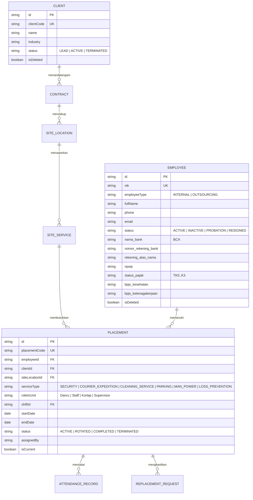

# 01_FRONTEND_FINAL_ARCHITECTURE.md — PT. BARAK IOMS
**Versi:** 3.0 (Authoritative Consolidated Architecture)  
**Tanggal:** 2 Oktober 2026  
**Perusahaan:** PT. Bimasena Adhirajasa Radhika (PT. BARAK)  
**Sistem:** Integrated Outsourcing Management System (IOMS)  
**Status:** COMPLETE & AUTHORITATIVE  
**Ruang Lingkup:** Arsitektur Berlapis Frontend, Model Domain, Pola Adapter & Kesiapan Integrasi Backend

---

## 1. Prinsip Desain & Batasan Lapisan (Architectural Layering)

Aplikasi frontend PT. BARAK IOMS distrukturkan secara tegas dengan prinsip **Pemisahan Tanggung Jawab (*Separation of Concerns*)** multi-lapis. Komponen Presentasi UI **dilarang keras** berinteraksi langsung dengan `localStorage`, memanipulasi *mock arrays* mentah, atau menyematkan logika bisnis hardcoded.

```
┌─────────────────────────────────────────────────────────────┐
│                    PRESENTATION LAYER                       │
│    (Pages, Modals, Drawers, Standard UI Components)         │
└──────────────────────────────┬──────────────────────────────┘
                               │ Memanggil Hooks & Handlers
┌──────────────────────────────▼──────────────────────────────┐
│                      CUSTOM HOOKS                           │
│   (useAuth, useRole, usePermissions, useForm, useTable)     │
└──────────────────────────────┬──────────────────────────────┘
                               │ Mengonsumsi Service Layer
┌──────────────────────────────▼──────────────────────────────┐
│                    APPLICATION SERVICES                     │
│  (Business Logic, Input Formatting, Validation, Audit Log)  │
└──────────────────────────────┬──────────────────────────────┘
                               │ Memanggil Repository Pattern
┌──────────────────────────────▼──────────────────────────────┐
│                     REPOSITORIES                            │
│  (Entity Queries, Filtering, Deduplication, Cache Sync)     │
└──────────────────────────────┬──────────────────────────────┘
                               │ Memanggil Service Adapters
┌──────────────────────────────▼──────────────────────────────┐
│                    SERVICE ADAPTERS                         │
│ (Dual-Mode: Mock LocalStore <--> Axios/Fetch REST Client)   │
└──────────────────────────────┬──────────────────────────────┘
                               │ HTTP REST Requests
┌──────────────────────────────▼──────────────────────────────┐
│               BACKEND REST API (EXPRESS / MYSQL)            │
│                 Base URL: /api/v1/* (MySQL 8.0)             │
└─────────────────────────────────────────────────────────────┘
```

---

## 2. Model Domain Utama & Pemisahan Keterikatan (Decoupling)

Domain bisnis aplikasi mencerminkan tata kelola perusahaan alih daya tenaga kerja terpadu di Indonesia dengan 3 domain data utama, 6 lini layanan outsourcing kanonikal, serta rantai relasi data yang terpisah secara tegas:



### Aturan Workforce Mobility (Non-Negotiable)
1. Entitas `employees` **tidak terikat langsung secara permanen** ke tabel `clients`.
2. Hubungan Karyawan $\leftrightarrow$ Klien **wajib** dijembatani oleh `placements` dengan histori status (`ACTIVE`, `ROTATED`, `ENDED`).
3. Seluruh riwayat perpindahan posko / rotasi personel tersimpan utuh di tabel histori penempatan.

---

## 3. Struktur Direktori Final (Directory Structure)

```text
src/
├── app/
│   ├── guards/
│   │   ├── RequireAuth.jsx          # Proteksi rute terautentikasi (JWT / Session)
│   │   └── RequireRole.jsx          # Proteksi rute berbasis 8 peran (RBAC)
│   ├── router/
│   │   └── index.jsx                # Router provider entry point
│   └── routes/
│       ├── authRoutes.jsx           # Rute privat login (/ops/login)
│       ├── publicRoutes.jsx         # Rute landing page publik (FROZEN)
│       ├── roleRoutes.jsx           # 8 Modul peran + Master + Cross-cutting
│       └── index.jsx                # Assembler seluruh rute aplikasi
│
├── components/
│   ├── layout/
│   │   ├── AppShell.jsx             # Shell utama dashboard internal
│   │   ├── Sidebar.jsx              # Navigasi samping dinamis berbasis peran
│   │   ├── Topbar.jsx               # Header navigasi, pencarian, & profil
│   │   └── DevIndicatorModal.jsx    # Switcher peran & utilitas development
│   └── ui/                          # Pustaka UI Standar Terpadu (Design Tokens)
│       ├── Badge.jsx                # Badge status semantik (success, danger, etc.)
│       ├── Breadcrumbs.jsx          # Navigasi remah roti hirarkis
│       ├── Button.jsx               # Tombol standar dengan varian & loading spinner
│       ├── Card.jsx                 # Wadah kartu terstandarisasi
│       ├── Drawer.jsx               # Off-canvas slide-over untuk detail rekaman
│       ├── FormField.jsx            # Wrapper input dengan label & pesan validasi
│       ├── Modal.jsx                # Dialog modal terpusat
│       ├── PageHeader.jsx           # Header halaman semantik dengan aksi CTA
│       ├── PageLoader.jsx           # Indikator loading halaman penuh
│       ├── Pagination.jsx           # Kontrol paginasi data tabular
│       ├── Table.jsx                # Komponen tabel berseri responsif
│       ├── Tabs.jsx                 # Navigasi tab status horizontal
│       └── index.js                 # Export barrel terpadu
│
├── constants/
│   ├── business.js                  # Master data statis (18 Klien riil, layanan)
│   ├── permissions.js               # Definisi izin granular sistem (PERMISSIONS)
│   ├── roles.js                     # Enum 8 peran resmi & label (ROLES)
│   └── status.js                    # Enum status seragam lintas departemen (STATUS)
│
├── data/
│   ├── repositories/
│   │   ├── baseRepository.js        # Pola CRUD dasar, deduplikasi, soft delete
│   │   ├── clientRepository.js      # Akses data klien
│   │   ├── employeeRepository.js    # Akses data SDM & permohonan hapus
│   │   ├── placementRepository.js   # Akses penugasan & riwayat rotasi
│   │   └── siteRepository.js        # Akses lokasi & posko jaga
│   └── storage/
│       └── storageEngine.js         # Abstraksi persisten dengan namespace & healing
│
├── features/
│   ├── audit/                       # Monitoring log audit eksekutif
│   ├── auth/                        # Halaman login operasional
│   ├── director/                    # Cockpit eksekutif Direktur & Approval Center
│   ├── finance/                     # Faktur, Payroll, Kas Masuk, COD Kurir
│   ├── hrd/                         # Presensi posko, monitoring kontrak PKWT
│   ├── it/                          # Helpdesk, SLA, Aset IT Posko, Maintenance
│   ├── landing/                     # Halaman publik (DIBEKUKAN / FROZEN 100%)
│   ├── legal/                       # PKS Korporat, sengketa perkara, SIO BUJP Polri
│   ├── marketing/                   # Manajemen leads, pipeline tender, deal handover
│   ├── master/                      # Master karyawan, klien, lokasi, shift, user
│   ├── notifications/               # Pusat notifikasi internal dengan RBAC detail
│   ├── operations/                  # Formasi posko, insiden lapangan, rotasi personel
│   ├── profile/                     # Pengaturan profil pengguna
│   ├── search/                      # Pencarian global multi-entitas
│   └── website/                     # CMS Berita, karir, FAQ, SEO metadata
│
├── services/
│   ├── adapters/                    # 24 Adapter Layanan (Mock/REST Dual Mode)
│   │   ├── assignmentAdapter.js
│   │   ├── attendanceAdapter.js
│   │   ├── auditAdapter.js
│   │   ├── authAdapter.js
│   │   ├── clientAdapter.js
│   │   ├── cmsAdapter.js
│   │   ├── codAdapter.js
│   │   ├── contractAdapter.js
│   │   ├── directorAdapter.js
│   │   ├── employeeAdapter.js
│   │   ├── fieldReportAdapter.js
│   │   ├── fileAdapter.js           # Abstraksi penyimpanan dokumen (S3/Cloud Vault)
│   │   ├── incidentAdapter.js
│   │   ├── invoiceAdapter.js
│   │   ├── itAdapter.js
│   │   ├── legalAdapter.js
│   │   ├── locationAdapter.js
│   │   ├── marketingAdapter.js
│   │   ├── notificationAdapter.js
│   │   ├── payrollAdapter.js
│   │   ├── replacementAdapter.js
│   │   ├── searchAdapter.js
│   │   ├── shiftAdapter.js
│   │   └── userAdapter.js
│   ├── apiClient.js                 # Klien HTTP terpusat (Axios/Fetch Wrapper)
│   └── mock/                        # Data benih terstruktur untuk development
│
└── utils/
    ├── auditLogger.js               # Generator & emitter rekaman audit
    ├── demoDataReset.js             # Reset pabrik demo dengan proteksi klien riil
    ├── imageResize.js               # Utilitas crop & auto-resize pas foto 3x4
    └── storage.js                   # Wrapper localStorage dengan event reactive
```

---

## 4. Sakelar Dual-Mode API (Mock Mode vs REST Mode)

Sistem dikonfigurasikan agar dapat beralih dari lingkungan simulasi lokal (*Mock Local Storage*) ke backend server resmi (*Node.js Express / MySQL*) **hanya dengan mengubah variabel lingkungan**:

```env
# Mode Pengujian Frontend / Offline
VITE_API_MODE=mock

# Mode Produksi / Koneksi Backend Hidup
VITE_API_MODE=rest
VITE_API_BASE_URL=http://localhost:3001/api/v1
```

Setiap fungsi di dalam file adapter menerapkan pola gerbang:
```javascript
export const employeeAdapter = {
  async getEmployees(params) {
    if (isMockMode()) {
      // Baca dan filter dari repository / storage lokal terdeduplikasi
      return localMockRead(params);
    }
    // Kirim HTTP request standar ke backend Express
    const { data } = await apiClient.get('/employees', { params });
    return data;
  }
};
```
Dengan arsitektur ini, tim backend dapat mengimplementasikan endpoint satu per satu tanpa mengacaukan antarmuka pengguna yang telah berjalan.

---

## 5. Pola Akses Data (Repository Pattern)

Repository bertindak sebagai jembatan antara kebutuhan bisnis komponen dan sumber data aktual:
1. **Deduplikasi Otomatis:** Menjamin tidak ada rekaman dengan ID primer ganda.
2. **Soft-Delete Enforcement:** Data yang dihapus tidak langsung hilang secara fisik, melainkan ditandai `isDeleted: true` dan dikecualikan dari query aktif secara transparan.
3. **Reactive Event Dispatching:** Setiap mutasi data memicu event `barak_storage_mutation` untuk menyinkronkan komponen secara instan.
4. **Data Healing & Fallback:** Menjamin konsistensi data riil mitra klien dan struktur akun pengguna saat runtime.
