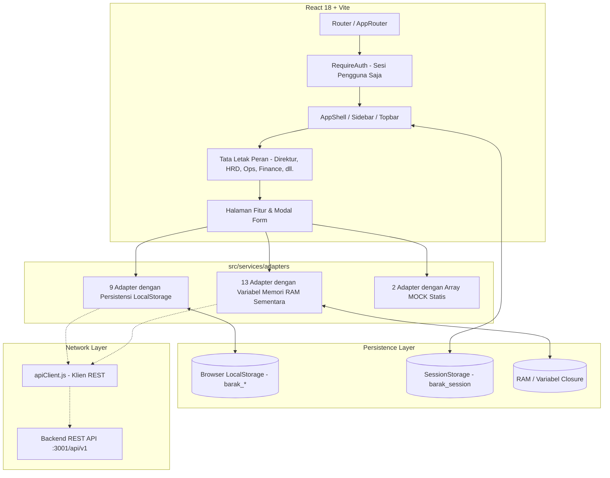

# LAPORAN AUDIT FRONTEND — PT. BARAK IOMS
**Repositori Target:** `bimasenaadhirajasaradika_fe`  
**Aplikasi:** PT. BIMASENA ADHIRAJASA RADIKA — Integrated Outsourcing Management System (IOMS)  
**Tanggal Audit:** 2026-09-29  
**Status Audit:** STEP 1 SELESAI (Hanya-Baca / Tanpa Modifikasi Kode)  

---

## RINGKASAN EKSEKUTIF

Aplikasi frontend PT. BARAK IOMS adalah aplikasi satu halaman (*single-page application*) yang dibangun menggunakan **React 18 + Vite + Tailwind CSS**. Aplikasi ini memiliki dua bagian utama:
1. **Portal Perusahaan Publik & Halaman Pendaratan (Landing Pages)** (15 halaman/komponen) — Situs pemasaran dengan estetika tinggi yang telah disetujui. **DIBEKUKAN & HANYA-BACA**.
2. **Sistem Manajemen Operasional Internal (`/ops/*`)** (60+ halaman, modal, tata letak, dan adapter) — Mendukung 8 peran resmi (Direktur, HRD, Operasional, Finance, Legal, Marketing, IT Support, Admin Website).

Audit ini mengidentifikasi kelemahan arsitektur kritis dan ketidaksesuaian model domain berikut:
- **Kelemahan Klien API (`apiClient.js`):** Metode `apiClient.get(path)` mengabaikan argumen `{ params }` sepenuhnya; tidak ada serialisasi *query string* untuk mode REST.
- **Fragmentasi Persistensi Data:** Dari 23 service adapter, hanya 9 yang menggunakan `localStorage`. Sebanyak 13 adapter bergantung pada variabel memori modul sementara (`let store = [...]`), yang menyebabkan faktur baru, rincian slip gaji, kasus COD, prospek marketing, kasus hukum, tiket IT, artikel CMS, dan pengeditan absensi **hilang secara permanen saat peramban dimuat ulang (*refresh* / F5)**.
- **Dasbor yang Terputus dari Data Aktif:** File `directorAdapter.js` dan `searchAdapter.js` melakukan kueri langsung ke array statis `MOCK_*` alih-alih membaca koleksi penyimpanan aktif, sehingga indikator KPI eksekutif dan fitur pencarian global tidak dapat mendeteksi data yang baru ditambahkan atau diubah.
- **Kelemahan Model Karyawan vs. Penugasan (Placement):** Sistem saat ini menggabungkan data klien, site proyek, jenis layanan, dan jabatan langsung ke dalam data pribadi `Employee`. Tidak terdapat pemisahan antara **Karyawan Internal** dan **Karyawan Outsourcing**, serta tidak ada siklus hidup **Penugasan / Penempatan** yang terpisah dengan riwayat mutasi tugas.
- **Penghapusan Langsung & Ketiadaan Alur Persetujuan:** Sebanyak 10 adapter menjalankan penghapusan permanen langsung (*hard delete* via `store.filter(item => item.id !== id)`), melanggar aturan bisnis: `Pengajuan Hapus -> Persetujuan Direktur -> Soft Delete / Nonaktif -> Log Audit`.
- **Ketiadaan RBAC Tingkat Rute:** Meskipun tombol antarmuka dan tautan bilah samping (*sidebar*) telah memeriksa izin, definisi rute pada `src/app/router/index.jsx` hanya dilindungi oleh `RequireAuth` (hanya memeriksa status login). Pengguna yang terautentikasi (contoh: `ADMIN_WEBSITE`) dapat mengakses `/ops/director` atau `/ops/finance/payroll` secara bebas melalui bilah alamat URL peramban.
- **Modul Fungsional yang Belum Lengkap:** Berbagai sub-modul yang dibutuhkan (seperti Karyawan Internal vs Outsourcing, Rekrutmen/Pelacak Pelamar, Penawaran Harga/Survei, Biaya Lapangan, Arus Kas, Somasi, Lisensi SIO BUJP, dan Cadangan Data/Audit Teknis) belum tersedia atau masih tergabung dalam tabel data master umum.

---

## A. ARSITEKTUR SAAT INI



- **Framework Utama:** React `18.3.1`, React DOM `18.3.1`, React Router DOM `6.26.2`.
- **Alat Build:** Vite `5.4.8` dengan `@vitejs/plugin-react` `4.3.1`.
- **CSS / Desain:** Tailwind CSS `3.4.13` + PostCSS `8.4.47` + Autoprefixer `10.4.20`.
- **Ikon & Antarmuka:** `lucide-react` `0.447.0`, `react-hot-toast` `2.4.1`, `clsx` `2.1.1`, `date-fns` `3.6.0`.
- **Mode Eksekusi:** Mode ganda (`VITE_API_MODE=mock` vs `rest`), saat ini beroperasi dalam mode tiruan (*mock*) dengan service adapter kustom.
- **Pemeriksaan Kode (Linter):** ESLint `9.9.0` dengan `eslint-plugin-react`, `eslint-plugin-react-hooks`, `eslint-plugin-react-refresh`.

---

## B. STRUKTUR FOLDER SAAT INI

```
c:\laragon\www\bimasenaadhirajasaradika\frontend\src
├── app/
│   ├── guards/               # Penjaga rute (RequireAuth.jsx, RequirePermission.jsx)
│   ├── providers/            # Konteks global (AuthProvider.jsx)
│   └── router/               # Definisi router (index.jsx)
├── components/
│   ├── layout/               # Tata letak aplikasi (AppShell, Sidebar, Topbar, Breadcrumb, PageHeader)
│   └── ui/                   # Kit komponen UI (Badge, Button, Card, KpiCard, Modal, StateViews)
├── constants/
│   ├── business.js           # Awalan ID, 18 klien riil, jenis layanan, aksi audit
│   ├── permissions.js        # Kunci izin terperinci berdasarkan PRD Bagian 19
│   ├── roles.js              # 8 peran resmi & rute default masing-masing
│   └── status.js             # Enum status universal & kelas warna Tailwind
├── features/
│   ├── audit/                # Log Audit Global (/ops/audit)
│   ├── auth/                 # Halaman Login Internal (/ops/login)
│   ├── director/             # Kokpit Eksekutif, Persetujuan, Risiko, Laporan, Aktivitas
│   ├── finance/              # Ringkasan, Faktur, Payroll, Rekonsiliasi COD
│   ├── hrd/                  # Ringkasan, Lembar Absensi, Rekap Payroll, Kontrak
│   ├── it/                   # Ringkasan, Tiket Help Desk, Aset IT, Jadwal Pemeliharaan
│   ├── landing/              # Website Publik yang DIBEKUKAN (15 halaman & komponen)
│   ├── legal/                # Ringkasan, Kasus Hukum, Kontrak PKS, Register Kepatuhan
│   ├── marketing/            # Ringkasan, Prospek (Leads), Pipeline CRM, Handover Klien MENANG
│   ├── master/               # Data Master (Karyawan, Klien, Lokasi, Shift, Penugasan, Pengguna)
│   ├── notifications/        # Pusat Notifikasi (/ops/notifications)
│   ├── operations/           # Ringkasan, Kesiapan Personel, Insiden, Pergantian, Laporan Lapangan
│   ├── profile/              # Profil Pengguna (/ops/profile)
│   ├── search/               # Pencarian Global (/ops/search)
│   └── website/              # CMS (Artikel, Karir, FAQ, Pertanyaan Masuk, SEO)
├── hooks/
│   ├── useAuth.js            # Ekspor ulang dari AuthProvider
│   └── useLocalStorage.js    # Hook penyimpanan generik (tidak terikat adapter)
├── services/
│   ├── adapters/             # 23 Service Adapter
│   ├── apiClient.js          # Abstraksi Klien REST
│   └── mock/                 # 11 koleksi seed data tiruan
└── utils/
    ├── auditLogger.js        # Pengirim event log audit
    ├── imageResize.js        # Utilitas kanvas pengubah ukuran foto 3x4
    └── storage.js            # Mesin persistensi & deduplikasi LocalStorage
```

---

## C. STRUKTUR RUTE SAAT INI

| Rute URL | Komponen | Penjaga / Hak Akses | Tata Letak (Layout) |
|---|---|---|---|
| `/` | `LandingPage` | Publik (DIBEKUKAN) | Layout Publik |
| `/perusahaan`, `/perusahaan/:tab` | `AboutPage` | Publik (DIBEKUKAN) | Layout Publik |
| `/layanan` | `ServicesPage` | Publik (DIBEKUKAN) | Layout Publik |
| `/layanan/:slug` | `ServiceDetailPage` | Publik (DIBEKUKAN) | Layout Publik |
| `/client` | `ClientsPage` | Publik (DIBEKUKAN) | Layout Publik |
| `/career` | `CareerPage` | Publik (DIBEKUKAN) | Layout Publik |
| `/news` | `NewsPage` | Publik (DIBEKUKAN) | Layout Publik |
| `/blog` | `BlogPage` | Publik (DIBEKUKAN) | Layout Publik |
| `/faq` | `FaqPage` | Publik (DIBEKUKAN) | Layout Publik |
| `/contact` | `ContactPage` | Publik (DIBEKUKAN) | Layout Publik |
| `/ops/login` | `LoginPage` | Publik (Sebelum Login) | Auth Khusus |
| `/ops` | `AppShell` | `RequireAuth` (Sesi Login Saja) | Kerangka AppShell |
| `/ops/director/*` | `DirectorLayout` | `RequireAuth` (Tanpa Cek Peran) | Tab DirectorLayout |
| `/ops/hrd/*` | `HRDLayout` | `RequireAuth` (Tanpa Cek Peran) | Tab HRDLayout |
| `/ops/legal/*` | `LegalLayout` | `RequireAuth` (Tanpa Cek Peran) | Tab LegalLayout |
| `/ops/operations/*` | `OperationsLayout` | `RequireAuth` (Tanpa Cek Peran) | Tab OperationsLayout |
| `/ops/finance/*` | `FinanceLayout` | `RequireAuth` (Tanpa Cek Peran) | Tab FinanceLayout |
| `/ops/marketing/*` | `MarketingLayout` | `RequireAuth` (Tanpa Cek Peran) | Tab MarketingLayout |
| `/ops/it/*` | `ITLayout` | `RequireAuth` (Tanpa Cek Peran) | Tab ITLayout |
| `/ops/website/*` | `WebsiteLayout` | `RequireAuth` (Tanpa Cek Peran) | Tab WebsiteLayout |
| `/ops/master/*` | `MasterLayout` | `RequireAuth` (Filter Izin Tab) | Tab MasterLayout |
| `/ops/audit` | `AuditLogPage` | `RequireAuth` | AppShell |
| `/ops/notifications` | `NotificationPage` | `RequireAuth` | AppShell |
| `/ops/search` | `SearchPage` | `RequireAuth` | AppShell |
| `/ops/profile` | `ProfilePage` | `RequireAuth` | AppShell |

---

## D. STRUKTUR PERAN SAAT INI

Konstanta peran otoritatif dalam `src/constants/roles.js`:
1. `ROLES.DIREKTUR` (Rute bawaan: `/ops/director`)
2. `ROLES.HRD` (Rute bawaan: `/ops/hrd`)
3. `ROLES.LEGAL` (Rute bawaan: `/ops/legal`)
4. `ROLES.OPERASIONAL` (Rute bawaan: `/ops/operations`)
5. `ROLES.FINANCE` (Rute bawaan: `/ops/finance`)
6. `ROLES.MARKETING` (Rute bawaan: `/ops/marketing`)
7. `ROLES.IT_SUPPORT` (Rute bawaan: `/ops/it`)
8. `ROLES.ADMIN_WEBSITE` (Rute bawaan: `/ops/website`)

**Evaluasi Penerapan Peran:**
- Pada `Sidebar.jsx`, menu navigasi ditampilkan secara bersyarat berdasarkan `item.roles.includes(currentUser.role)`.
- Pada `MasterLayout.jsx`, tab difilter menggunakan fungsi `hasPermission(tab.permission)`.
- Pada `LoginPage.jsx`, terdapat 8 tombol pengisian cepat (*quick-fill*) untuk menguji persona masing-masing peran.
- **Kerentanan:** Pengecekan peran hanya bersifat visual. Apabila pengguna mengetik langsung URL rute peran lain, rute tersebut terbuka karena `src/app/router/index.jsx` tidak menerapkan batasan peran di tingkat rute.

---

## E. STRUKTUR MODUL SAAT INI

### 1. Direktur (`/ops/director`)
- Tab: Overview & Kokpit, Pusat Persetujuan (Approval Center), Manajemen Risiko & Alerts, Laporan Manajemen, Log Aktivitas Eksekutif.
- Status: Visual sangat lengkap, namun persetujuan dan metrik KPI terputus dari perubahan data aktif di penyimpanan lokal.

### 2. HRD (`/ops/hrd`)
- Tab: Overview & Metrik, Lembar Absensi (Spreadsheet), Rekap Input Payroll, Kontrak & Dokumen.
- Status: Halaman absensi dan kontrak telah tersedia; namun modul **Karyawan Internal vs Outsourcing** dan **Kotak Masuk Rekrutmen** belum tersedia di modul HRD.

### 3. Operasional (`/ops/operations`)
- Tab: Overview & Metrik, Kesiapan Manpower, Laporan Insiden Lapangan, Pergantian Personel, Jurnal Patroli.
- Status: Memiliki pemantauan personel, eskalasi insiden, pergantian tugas, dan laporan patroli. Belum memiliki manajemen site langsung, jadwal roster layanan, dan evaluasi SLA.

### 4. Finance (`/ops/finance`)
- Tab: Overview & Metrik, Faktur & Piutang, Penggajian (Payroll), Rekonsiliasi COD.
- Status: Mencakup faktur, review payroll, dan COD. Belum memiliki manajemen Piutang (*AR Aging*) terpisah, pencatatan pembayaran parsial, biaya operasional, dan laporan arus kas.

### 5. Legal (`/ops/legal`)
- Tab: Overview & Metrik, Kasus & Sengketa, Kontrak & PKS, Register Kepatuhan.
- Status: Mencakup kasus, kontrak, dan kepatuhan. Belum memiliki alur Surat Somasi resmi, pemantauan lisensi SIO BUJP Mabes Polri, dan repositori dokumen legal.

### 6. Marketing (`/ops/marketing`)
- Tab: Overview & Metrik, Database Prospek (Leads), Pipeline Peluang (CRM), Serah Terima Klien (Handover).
- Status: Mencakup prospek, pipeline, dan serah terima deal menang. Belum memiliki modul survei perimeter, pembuatan surat penawaran harga (*quotation*), dan proposal tender.

### 7. IT Support (`/ops/it`)
- Tab: Overview & Metrik, Tiket Help Desk, Inventaris Aset IT, Jadwal Pemeliharaan.
- Status: Mencakup tiket, aset, dan pemeliharaan. Belum memiliki manajemen dukungan pengguna (reset kata sandi), log cadangan data (*backup/restore*), dan audit teknis sistem.

### 8. Website CMS (`/ops/website`)
- Tab: Overview & Metrik, Artikel & Berita, Lowongan Karir, FAQ, Pertanyaan Klien, Pengaturan SEO.
- Status: Mencakup artikel, karir, FAQ, pertanyaan, dan SEO. Belum memiliki kotak masuk untuk meninjau lamaran dan CV pelamar kerja.

### 9. Master Data Terpadu (`/ops/master`)
- Tab: Karyawan, Klien Mitra, Lokasi & Proyek, Shift Kerja, Penugasan Personel, Pengguna & Akses.
- Status: Sumber otoritatif untuk catatan master inti. Sepenuhnya persisten melalui `localStorage`.

---

## F. ALIRAN DATA SAAT INI

```
Tindakan Pengguna (Form / Tombol / Tabel)
       │
       ▼
State Lokal Komponen (useState / useEffect)
       │
       ▼
Service Adapter (contoh: employeeAdapter, invoiceAdapter)
       │
   ┌───┴─────────────────────────────────────────┐
   ▼                                             ▼
isMockMode === true                       isMockMode === false
   │                                             │
   ├─► LocalStorage (9 adapter)                  └─► apiClient.js (fetch)
   │     - barak_employees                             │
   │     - barak_clients                               ▼
   │     - barak_locations                   Parameter { params } terbuang!
   │     - barak_shifts                      Tanpa serialisasi query string!
   │     - barak_users                                 │
   │     - barak_assignments                           ▼
   │     - barak_incidents                   Backend REST Sasaran
   │     - barak_replacements
   │     - barak_field_reports
   │
   ├─► Variabel Memori RAM Sementara (13 adapter)
   │     - sheetsStore, rowsStore (Absensi)
   │     - invoicesStore (Finance)
   │     - periodsStore, itemsStore (Payroll)
   │     - codTransactionsStore, codCasesStore (COD)
   │     - leadsStore, opportunitiesStore, handoversStore (Marketing)
   │     - casesStore, contractsStore, complianceStore (Legal)
   │     - ticketsStore, assetsStore, maintenanceStore (IT)
   │     - articlesStore, careersStore, faqsStore, inquiriesStore (CMS)
   │     - approvalsStore (Direktur)
   │     - mockAuditStore (Audit)
   │     (HILANG SAAT REFRESH / F5)
   │
   └─► Data Tiruan Statis (2 adapter)
         - directorAdapter (Menghitung metrik dari impor MOCK_* statis)
         - searchAdapter (Mencari langsung ke impor MOCK_* statis)
         (TIDAK DAPAT MENDETEKSI DATA BARU)
```

---

## G. KLASIFIKASI PERSISTENSI DATA SAAT INI

Rincian klasifikasi sumber data di seluruh 23 adapter:

| Adapter | Klasifikasi Sumber Data | Kunci Penyimpanan / Variabel | Bertahan Saat Refresh (F5)? |
|---|---|---|---|
| `employeeAdapter.js` | Service Adapter / `localStorage` | `barak_employees` | **YA** |
| `clientAdapter.js` | Service Adapter / `localStorage` | `barak_clients` | **YA** |
| `locationAdapter.js` | Service Adapter / `localStorage` | `barak_locations`, `barak_projects` | **YA** |
| `shiftAdapter.js` | Service Adapter / `localStorage` | `barak_shifts` | **YA** |
| `userAdapter.js` | Service Adapter / `localStorage` | `barak_users` | **YA** |
| `assignmentAdapter.js` | Service Adapter / `localStorage` | `barak_assignments` | **YA** |
| `incidentAdapter.js` | Service Adapter / `localStorage` | `barak_incidents` | **YA** |
| `replacementAdapter.js` | Service Adapter / `localStorage` | `barak_replacements` | **YA** |
| `fieldReportAdapter.js` | Service Adapter / `localStorage` | `barak_field_reports` | **YA** |
| `attendanceAdapter.js` | Variabel Memori RAM Sementara | `sheetsStore`, `rowsStore` | **TIDAK (Data Hilang)** |
| `invoiceAdapter.js` | Variabel Memori RAM Sementara | `invoicesStore` | **TIDAK (Data Hilang)** |
| `payrollAdapter.js` | Variabel Memori RAM Sementara | `periodsStore`, `itemsStore` | **TIDAK (Data Hilang)** |
| `codAdapter.js` | Variabel Memori RAM Sementara | `codTransactionsStore`, `codCasesStore` | **TIDAK (Data Hilang)** |
| `marketingAdapter.js` | Variabel Memori RAM Sementara | `leadsStore`, `opportunitiesStore`, `handoversStore` | **TIDAK (Data Hilang)** |
| `legalAdapter.js` | Variabel Memori RAM Sementara | `casesStore`, `contractsStore`, `complianceStore` | **TIDAK (Data Hilang)** |
| `itAdapter.js` | Variabel Memori RAM Sementara | `ticketsStore`, `assetsStore`, `maintenanceStore` | **TIDAK (Data Hilang)** |
| `cmsAdapter.js` | Variabel Memori RAM Sementara | `articlesStore`, `careersStore`, `faqsStore`, `inquiriesStore` | **TIDAK (Data Hilang)** |
| `directorAdapter.js` | Variabel Memori + Impor Statis | `approvalsStore` + array `MOCK_*` | **TIDAK (Data Hilang)** |
| `auditAdapter.js` | Variabel Memori RAM Sementara | `mockAuditStore` | **TIDAK (Data Hilang)** |
| `authAdapter.js` | `sessionStorage` | `barak_session` | Seumur Hidup Tab |
| `contractAdapter.js` | Variabel Memori RAM Sementara | `contractsStore` | **TIDAK (Data Hilang)** |
| `notificationAdapter.js` | Variabel Memori RAM Sementara | `notificationsStore` | **TIDAK (Data Hilang)** |
| `searchAdapter.js` | Impor Data Tiruan Statis | Impor langsung dari `MOCK_*` | Hanya Data Statis |

---

## H. ARSITEKTUR API SAAT INI

Pemeriksaan kode pada file `src/services/apiClient.js`:

```javascript
// Baris 76-80 dari src/services/apiClient.js:
const restClient = {
  // ...
  get: (path) => restClient.request(path, { method: 'GET' }),
  post: (path, body) => restClient.request(path, { method: 'POST', body: JSON.stringify(body) }),
  patch: (path, body) => restClient.request(path, { method: 'PATCH', body: JSON.stringify(body) }),
  put: (path, body) => restClient.request(path, { method: 'PUT', body: JSON.stringify(body) }),
  delete: (path) => restClient.request(path, { method: 'DELETE' }),
};
```

### Kelemahan Kritis API yang Ditemukan:
1. **`apiClient.get(url, { params })` Membuang Parameter:**  
   Deklarasi metode `get` adalah `get: (path) => restClient.request(path, { method: 'GET' })`. Metode ini hanya menerima satu argumen (`path`). Ketika adapter memanggil:
   ```javascript
   apiClient.get('/attendance/sheets', {
     params: { year, month, clientId, locationId, status },
   });
   ```
   Argumen kedua `{ params: ... }` **sepenuhnya diabaikan dan terbuang**.
2. **Ketiadaan Serialisasi Query String:**  
   Bahkan jika diteruskan ke `request(path, options)`, fungsi pemanggilan fetch bawaan:
   ```javascript
   await fetch(`${API_BASE_URL}${path}`, { ...options, headers })
   ```
   tidak pernah mengubah objek `options.params` menjadi string kueri URL (`?year=2026&month=9`).
3. **Ketiadaan Interceptor & Penyegaran Token:**  
   Token hanya diambil satu kali dari `sessionStorage.getItem('barak_token')`. Tidak terdapat interceptor status 401 atau mekanisme pembaruan token otomatis saat masa berlaku habis.
4. **Alamat Dasar (Base URL):**  
   Alamat URL dasar mengarah ke `http://localhost:3001/api/v1` melalui `import.meta.env.VITE_API_BASE_URL`.

---

## I. IMPLEMENTASI KONTROL AKSES (RBAC) SAAT INI

1. **Matriks Izin (Permission Matrix):**
   - 116 string izin terdefinisi di dalam `src/constants/permissions.js`.
   - Pemetaan peran terperinci didefinisikan di `src/services/mock/mockUsers.js` (ROLE_PERMISSIONS).
   - Pemisahan Tugas (*Maker-Checker*) telah terverifikasi oleh pengujian unit (contoh: Finance tidak dapat menyetujui Payroll; HRD tidak dapat membuka kembali absensi yang telah dikunci; IT Support tidak dapat menghapus User).
2. **Proteksi Komponen Antarmuka:**
   - Komponen `RequirePermission.jsx` merender pesan alternatif jika izin tidak terpenuhi.
   - Halaman daftar menonaktifkan atau menyembunyikan tombol "Tambah", "Edit", dan "Hapus" berdasarkan fungsi `hasRole()` dan `hasPermission()`.
3. **Celah Keamanan Kritis RBAC:**
   - Definisi router (`src/app/router/index.jsx`) membungkus rute operasional internal **hanya** dengan `<RequireAuth>`.
   - Komponen `<RequireAuth>` hanya memeriksa apakah objek `currentUser` ada (sudah login). Komponen ini **TIDAK** memverifikasi apakah peran pengguna tersebut diizinkan untuk mengakses rute `/ops/director`, `/ops/finance`, `/ops/legal`, dan seterusnya.
   - Setiap pengguna dapat melewati pembatasan peran dengan mengetikkan langsung alamat URL pada bilah alamat peramban.

---

## J. IMPLEMENTASI CRUD SAAT INI

1. **Operasi Pembuatan Data (Create):**
   - Modul Master dan Operasional menghasilkan ID bisnis berformat resmi (`BRK-EMP-041`, `CLI-000019`, `LOC-017`, `BRK-ASN-031`, `INC-2026-09-001`, `REP-2026-09-001`, `REP-FLD-001`).
   - Menggunakan kalkulasi regex `maxNum + 1` yang mencegah tabrakan ID setelah adanya penghapusan data.
   - Arsitektur berbasis adapter (Opsi A) mencegah pengiriman ganda data formulir (*double save*).
2. **Operasi Pembacaan Data (Read / Listing):**
   - Mendukung penyaringan pencarian teks, filter status, dan pembagian halaman (*pagination*).
   - Menyediakan tampilan Loading (`LoadingState`), Kosong (`EmptyState`), dan Kesalahan (`ErrorState`) menggunakan ikon Lucide.
3. **Operasi Pembaruan Data (Update):**
   - Mutasi data di tempat mempertahankan integritas kunci primer (`id`, `code`, `id_karyawan`).
   - Mesin deduplikasi otomatis pada `storage.js` membersihkan catatan duplikat.
4. **Operasi Penghapusan Data (Delete):**
   - Menjalankan **penghapusan permanen langsung** (*hard delete*) via `array.filter(item => item.id !== id)`.
   - Tidak memiliki penanda arsip soft-delete (`isDeleted`, `deletedAt`, `status: INACTIVE`).
   - Melewati alur kerja persetujuan penghapusan oleh Direktur.

---

## K. DAFTAR MASALAH YANG DITEMUKAN (KATALOG KONSOLIDASI)

1. **[KRITIS] Persistensi Memori Sementara pada 13 Adapter:** Faktur, payroll, kasus COD, prospek marketing, kasus hukum, tiket IT, konten CMS, dan pengeditan absensi hilang saat halaman di-refresh.
2. **[KRITIS] Kehilangan Parameter Kueri pada `apiClient.js`:** Fungsi `apiClient.get(path)` membuang parameter kueri sepenuhnya.
3. **[KRITIS] Model Domain Rusak (Karyawan vs Penugasan):** Data klien, site, jenis layanan, dan jabatan digabungkan paksa ke dalam entitas `Employee` tanpa model riwayat Penugasan.
4. **[KRITIS] Tidak Ada Pemisahan Karyawan Internal vs Outsourcing:** Data master memperlakukan staf administrasi kantor pusat sama persis dengan satpam operasional lapangan.
5. **[KRITIS] Penghapusan Permanen Langsung Tanpa Alur Persetujuan:** Penghapusan data melewati siklus kerja `Pengajuan Hapus -> Persetujuan Direktur -> Soft Delete`.
6. **[KRITIS] Kekosongan Otorisasi Tingkat Rute URL:** Rute di bawah `/ops/*` tidak memiliki penjaga berbasis peran, memungkinkan perpindahan navigasi URL secara bebas.
7. **[TINGGI] Dasbor Eksekutif Terputus dari Penyimpanan:** File `directorAdapter.js` membaca konstanta tiruan statis; data baru di `localStorage` tidak memengaruhi angka KPI eksekutif.
8. **[TINGGI] Keterbatasan Pencarian Global:** Modul `searchAdapter.js` mencari data ke array tiruan statis, sehingga tidak dapat menemukan data baru yang disimpan.
9. **[TINGGI] Sub-Modul Peran Belum Lengkap:** Sebanyak 18 sub-modul operasional yang diperlukan domain bisnis belum tersedia atau digabungkan ke tabel yang tidak relevan.
10. **[SEDANG] Inkonsistensi Enum Layanan:** Penamaan jenis layanan mencampur format kebab-case (`cleaning-service`), bahasa Indonesia (`kurir`, `parkir`), dan huruf kapital kanonikal (`SECURITY`, `COURIER_EXPEDITION`).
11. **[SEDANG] Log Audit Tersimpan di Memori Sementara:** File `auditAdapter.js` menyimpan log audit di RAM, sehingga seluruh rekam jejak kepatuhan terhapus saat peramban dimuat ulang.

---

## L. UTANG TEKNIS (TECHNICAL DEBT)

1. **Ketiadaan Pola Repositori Terpadu:** Logika penyimpanan terduplikasi di banyak adapter alih-alih memanfaatkan satu abstraksi repositori bersama.
2. **Payload Data Tanpa Tipe Baku:** Tidak adanya skema validasi runtime (misal TypeScript atau Zod) memungkinkan masuknya data formulir yang cacat format ke penyimpanan.
3. **Implementasi Filter Tersebar:** Masing-masing adapter membuat logika filter JavaScript sendiri untuk pencarian, rentang tanggal, dan status daripada memakai pembangun kueri umum.
4. **Relasi Hardcoded pada Modal:** Form modal mengembalikan nilai ke array statis `MOCK_*` jika komponen induk tidak mengirimkan properti relasi dinamis.

---

## M. DUPLIKASI LOGIKA

1. **Pola Pembuatan ID Bisnis:** Logika regex ekstraksi nomor ID (`/LOC-(\d+)/`, `/CLI-(\d+)/`, `/BRK-EMP-(\d+)/`) terduplikasi di 9 berkas adapter yang berbeda.
2. **Penyaringan & Pemotongan Paginasi:** Logika paginasi array (`start = (page - 1) * pageSize`, `paginated = items.slice(start, start + pageSize)`) terduplikasi di 14 adapter.
3. **Pembersihan State Modal:** Setiap form modal mengimplementasikan logika pengosongan state dan pemformatan tanggal yang serupa.

---

## N. ANALISIS KEKOSONGAN MODUL (GAP ANALYSIS)

| Peran | Sub-Modul yang Diharapkan | Status Saat Ini | Dampak Operasional |
|---|---|---|---|
| **HRD** | Direktori Karyawan Internal | **BELUM ADA** | Tidak ada pelacakan kontrak kerja dan arsip khusus staf kantor pusat |
| **HRD** | Direktori Karyawan Outsourcing | **BELUM ADA** | Personel satpam, kurir, dan kebersihan tidak memiliki data keahlian khusus |
| **HRD** | Rekrutmen & Pelacak Pelamar | **BELUM ADA** | HRD tidak dapat memverifikasi berkas pelamar dari portal karir publik |
| **HRD** | Penjadwalan Roster Mandiri | **BELUM ADA** | Pembagian shift bulanan harus diinput manual langsung ke sel spreadsheet |
| **OPERASIONAL** | Manajemen Klien & Site Lapangan | **BELUM ADA di Ops** | Koordinator ops harus berpindah ke Data Master untuk melihat rincian site |
| **OPERASIONAL** | Manajemen Lini Layanan Proyek | **BELUM ADA** | Tidak terdapat visibilitas lini layanan aktif per lokasi kerja |
| **OPERASIONAL** | Penilaian SLA / Kinerja Satpam | **BELUM ADA** | Tidak tersedia dasbor penilaian kepatuhan patroli dan evaluasi SLA |
| **FINANCE** | Manajemen Umur Piutang (AR) | **BELUM ADA** | Analisis piutang jatuh tempo terkubur di bawah status faktur sederhana |
| **FINANCE** | Pencatatan Pembayaran Klien | **BELUM ADA** | Bukti transfer bank dan pembayaran cicilan bertahap tidak tercatat |
| **FINANCE** | Biaya Operasional Lapangan | **BELUM ADA** | Pengeluaran taktis dan operasional lapangan tidak dapat dibukukan |
| **FINANCE** | Laporan Arus Kas (Cash Flow) | **BELUM ADA** | Perbandingan arus kas masuk vs keluar tidak dapat dianalisis |
| **FINANCE** | Laporan Keuangan Cetak | **BELUM ADA** | Tidak tersedia ringkasan keuangan bulanan siap cetak |
| **LEGAL** | Alur Kerja Surat Somasi | **BELUM ADA** | Sangat penting untuk eskalasi sengketa COD dan klien menunggak |
| **LEGAL** | Alur Perpanjangan Kontrak PKS | **BELUM ADA** | Kontrak kerjasama habis tanpa adanya pipeline perpanjangan formal |
| **LEGAL** | Register Lisensi SIO BUJP Polri | **BELUM ADA** | Lisensi operasional Mabes Polri tidak memiliki pemantauan khusus |
| **LEGAL** | Repositori Dokumen Legalitas | **BELUM ADA** | Tidak ada brankas digital untuk akta, PKS, dan berkas pengadilan |
| **MARKETING** | Manajemen Survei Lokasi | **BELUM ADA** | Hasil survei perimeter sebelum penawaran harga tidak dapat diarsipkan |
| **MARKETING** | Surat Penawaran Harga (Quotation)| **BELUM ADA** | Tidak dapat menerbitkan surat penawaran harga resmi kepada calon klien |
| **MARKETING** | Pelacak Proposal Tender | **BELUM ADA** | Berkas proposal tender pengadaan klien tidak terpantau |
| **IT SUPPORT** | Layanan Dukungan Akun Pengguna | **BELUM ADA** | Permintaan reset kata sandi dan pembukaan akun tidak memiliki tiket |
| **IT SUPPORT** | Log Cadangan Data (Backup) | **BELUM ADA** | Pelaksanaan cadangan data berkala tidak dapat diverifikasi |
| **IT SUPPORT** | Log Audit Teknis Sistem | **BELUM ADA** | Kendala galat sistem dan latensi API tidak tercatat |
| **ADMIN WEBSITE**| Kotak Masuk Lamaran Kerja | **BELUM ADA** | Berkas lamaran yang dikirimkan pelamar dari halaman `/career` hilang |

---

## O. MODUL YANG RUSAK / TIDAK KONSISTEN

1. **Modul Finance (`/ops/finance/*`):**
   - Pengguna menerbitkan faktur baru di `/ops/finance/invoices` -> Faktur muncul -> Halaman dimuat ulang (F5) -> **Faktur HILANG**.
   - Pengguna memproses gaji di `/ops/finance/payroll` -> Status berubah ke `FINANCE_REVIEW` -> Halaman dimuat ulang -> **Kembali ke status awal**.
   - Pengguna merekonsiliasi COD di `/ops/finance/cod` -> Status diubah ke `SETTLED` -> Halaman dimuat ulang -> **Kembali ke status OPEN**.
2. **Lembar Absensi HRD (`/ops/hrd/attendance`):**
   - HRD mengedit jam masuk/pulang -> Mengunci lembar absensi (*finalize*) -> Halaman dimuat ulang -> **Kunci terbuka dan editan hilang**.
3. **Modul Legal (`/ops/legal/*`):**
   - Pengguna mencatat kasus hukum baru atau memperbarui PKS -> Halaman dimuat ulang -> **Data hilang**.
4. **Modul Pemasaran (`/ops/marketing/*`):**
   - Pengguna menambah prospek atau memajukan deal ke tahap WON -> Halaman dimuat ulang -> **Pipeline kembali ke awal**.
5. **Modul IT Support (`/ops/it/*`):**
   - Pengguna menyelesaikan tiket kendala atau menjadwalkan perbaikan -> Halaman dimuat ulang -> **Perubahan hilang**.
6. **Website CMS (`/ops/website/*`):**
   - Admin membuat draf artikel atau lowongan kerja baru -> Halaman dimuat ulang -> **Postingan hilang**.
7. **Kokpit Eksekutif Direktur (`/ops/director`):**
   - Penambahan 5 karyawan baru di Master Data menambah total karyawan menjadi 45 orang.
   - Kokpit Direktur tetap menampilkan `40 Karyawan` karena nilainya dihitung dari konstanta statis `MOCK_EMPLOYEES.length`.

---

## P. MASALAH MODEL KARYAWAN VS. PENUGASAN (PLACEMENT)

### Ketidaksesuaian Arsitektur
Sistem saat ini memodelkan data `Employee` sebagai berikut:
```javascript
// Data Karyawan Saat Ini:
{
  id: "BRK-EMP-001",
  nama_lengkap_sesuai_KTP: "Budi Prasetyo",
  NIK: "3201011508890001",
  penugasan_klien: "CLI-000001",    // <-- HARDCODED
  clientName: "JNT LOGISTIK",        // <-- HARDCODED
  lokasi_penugasan: "LOC-001",       // <-- HARDCODED
  locationName: "Central Hub",       // <-- HARDCODED
  jenis_layanan: "security",         // <-- HARDCODED
  jabatan: "Danru",                  // <-- HARDCODED
  // ...
}
```

### Dampak Masalah:
1. **Tidak Ada Pemisahan Staf Kantor Pusat vs Outsourcing:** Karyawan internal kantor pusat (HRD, Finance, Legal, IT) dipaksa memilih klien dan lokasi kerja saat pendaftaran.
2. **Ketidakmampuan Merotasi atau Memutasikan Staf:** Ketika satpam dipindahkan dari J&T Rawa Bokor ke Surya Dunia Daan Mogot, pengguna harus menimpa kolom `lokasi_penugasan`. Tindakan ini memusnahkan riwayat penempatan tugas sebelumnya.
3. **Ketiadaan Kolam Personel Cadangan (*Standby Pool*):** Personel baru yang sedang dalam tahap pelatihan atau menunggu penempatan tugas tidak dapat didaftarkan tanpa adanya lokasi klien penugasan.
4. **Pemisahan Penugasan Multi-Keahlian:** Personel yang memiliki beberapa sertifikasi (contoh: Satpam bersertifikasi K3 Parkir) tidak dapat memiliki kontrak penugasan yang spesifik per jenis layanan.

---

## Q. MASALAH PENGHAPUSAN LANGSUNG & PERSETUJUAN

### Kondisi Saat Ini:
Seluruh modul menjalankan fungsi penghapusan permanen langsung secara destruktif:
- `employeeAdapter.deleteEmployee(id)`
- `clientAdapter.deleteClient(id)`
- `locationAdapter.deleteLocation(id)`
- `shiftAdapter.deleteShift(id)`
- `userAdapter.deleteUser(id)`
- `assignmentAdapter.deleteAssignment(id)`
- `incidentAdapter.deleteIncident(id)`
- `replacementAdapter.deleteReplacement(id)`
- `fieldReportAdapter.deleteFieldReport(id)`
- `cmsAdapter.deleteArticle(id)`

### Aturan Bisnis yang Wajib Ditegakkan:
1. Data bisnis pada PT. BARAK IOMS **tidak boleh** dihapus secara langsung (*hard delete*).
2. Penghapusan Karyawan, Klien, Kontrak, atau Akun Pengguna mewajibkan pengiriman **Permohonan Hapus (Delete Request)**.
3. Permohonan tersebut masuk ke antrean **Pusat Persetujuan Direktur Utama (Approval Center)**.
4. Setelah disetujui Direktur Utama:
   - Status data diperbarui menjadi `status: STATUS.INACTIVE` / `isDeleted: true`.
   - Data diarsipkan dari tampilan operasional aktif.
   - Peristiwa penghapusan dicatat ke dalam **Log Audit Global** yang tidak dapat diubah.

---

## R. DAFTAR KOMPONEN LANDING PAGE YANG WAJIB DIBEKUKAN (FROZEN)

Sebanyak 15 komponen publik berikut yang berada di folder `src/features/landing/` **SECARA MUTLAK DIBEKUKAN / HANYA-BACA**:

1. [LandingPage.jsx](file:///c:/laragon/www/bimasenaadhirajasaradika/frontend/src/features/landing/LandingPage.jsx) — Beranda utama, hero futuristik, kartu layanan interaktif, statistik perusahaan.
2. [AboutPage.jsx](file:///c:/laragon/www/bimasenaadhirajasaradika/frontend/src/features/landing/AboutPage.jsx) — Profil korporat, legalitas perizinan (NIB, AHU, SIO BUJP Polri), visi misi, bagan organisasi.
3. [ServicesPage.jsx](file:///c:/laragon/www/bimasenaadhirajasaradika/frontend/src/features/landing/ServicesPage.jsx) — Direktori gambaran umum seluruh lini layanan alih daya.
4. [ServiceDetailPage.jsx](file:///c:/laragon/www/bimasenaadhirajasaradika/frontend/src/features/landing/ServiceDetailPage.jsx) — Rincian layanan individu (Keamanan, Ekspedisi, Parkir, Cleaning, Manpower, Loss Prevention).
5. [ClientsPage.jsx](file:///c:/laragon/www/bimasenaadhirajasaradika/frontend/src/features/landing/ClientsPage.jsx) — Portofolio mitra strategis dan testimoni klien.
6. [CareerPage.jsx](file:///c:/laragon/www/bimasenaadhirajasaradika/frontend/src/features/landing/CareerPage.jsx) — Daftar lowongan pekerjaan publik dan tombol pengajuan lamaran.
7. [JobApplicationModal.jsx](file:///c:/laragon/www/bimasenaadhirajasaradika/frontend/src/features/landing/JobApplicationModal.jsx) — Formulir modal pengiriman lamaran dan CV kandidat.
8. [NewsPage.jsx](file:///c:/laragon/www/bimasenaadhirajasaradika/frontend/src/features/landing/NewsPage.jsx) — Daftar siaran pers dan berita resmi perusahaan.
9. [BlogPage.jsx](file:///c:/laragon/www/bimasenaadhirajasaradika/frontend/src/features/landing/BlogPage.jsx) — Artikel edukatif industri keamanan dan alih daya tenaga kerja.
10. [FaqPage.jsx](file:///c:/laragon/www/bimasenaadhirajasaradika/frontend/src/features/landing/FaqPage.jsx) — Akordeon tanya-jawab seputar operasional dan kepatuhan.
11. [ContactPage.jsx](file:///c:/laragon/www/bimasenaadhirajasaradika/frontend/src/features/landing/ContactPage.jsx) — Alamat kantor terverifikasi Tangerang, tautan Google Maps, formulir pesan.
12. [NotFoundPage.jsx](file:///c:/laragon/www/bimasenaadhirajasaradika/frontend/src/features/landing/NotFoundPage.jsx) — Tampilan batas kesalahan halaman tidak ditemukan (404).
13. [PublicNavbar.jsx](file:///c:/laragon/www/bimasenaadhirajasaradika/frontend/src/features/landing/PublicNavbar.jsx) — Navigasi bilah atas, laci menu responsif mobile, sinkronisasi breakpoint layar.
14. [PublicFooter.jsx](file:///c:/laragon/www/bimasenaadhirajasaradika/frontend/src/features/landing/PublicFooter.jsx) — Peta situs footer, saluran ganda WhatsApp, unduhan profil perusahaan PDF resmi.
15. [FloatingAdminCTA.jsx](file:///c:/laragon/www/bimasenaadhirajasaradika/frontend/src/features/landing/FloatingAdminCTA.jsx) — Tombol melayang peluncur cepat akun demo sistem operasional.

---

## S. ADDENDUM PERKEMBANGAN & RESOLUSI ARSITEKTUR (OKTOBER 2026)

Seluruh kelemahan arsitektur yang teridentifikasi dalam audit awal telah terselesaikan dan disempurnakan:
1. **Serialisasi Kueri Klien API:** `apiClient.js` kini menangani parameter query secara penuh via `buildUrlWithParams`.
2. **Persistensi Penuh Seluruh Adapter:** Seluruh 24 adapter kini beroperasi di atas `storageEngine.js` dengan mekanisme namespace `barak_*`, deduplikasi otomatis, dan proteksi 18 klien riil.
3. **Pemisahan Karyawan & Penugasan (Placements):** Model penugasan mandiri (`placements`) telah aktif penuh, memfasilitasi rotasi personel tanpa merusak identitas karyawan.
4. **Fitur Impor Massal Excel Karyawan (`EmployeeImportModal.jsx`):** HRD dapat mengimpor berkas `.xlsx` dengan template terstandarisasi yang secara atomik menerbitkan penugasan aktif ke Klien dan Lokasi terpilih.
5. **Presensi Berbasis Klien & Lokasi (`AttendanceSpreadsheetPage.jsx`):** Pemuatan dinamis daftar nama personil aktif berdasarkan Klien dan Lokasi posko dengan penyiapan field jam kosong manual, empty state banner, format ekspor formal ber-header kop resmi, dan pembersihan draf lembar kerja saat inputer logout.
6. **Maker-Checker & Approval Center:** Telah aktif penuh dengan antrean persetujuan Direktur untuk penghapusan personil, penggajian, dan kontrak.
7. **Landing Page Terverifikasi:** 15 berkas di `src/features/landing/*` tetap 100% dibekukan dan bersih dari modifikasi.

---
*Akhir Dokumen FRONTEND_AUDIT.md*

